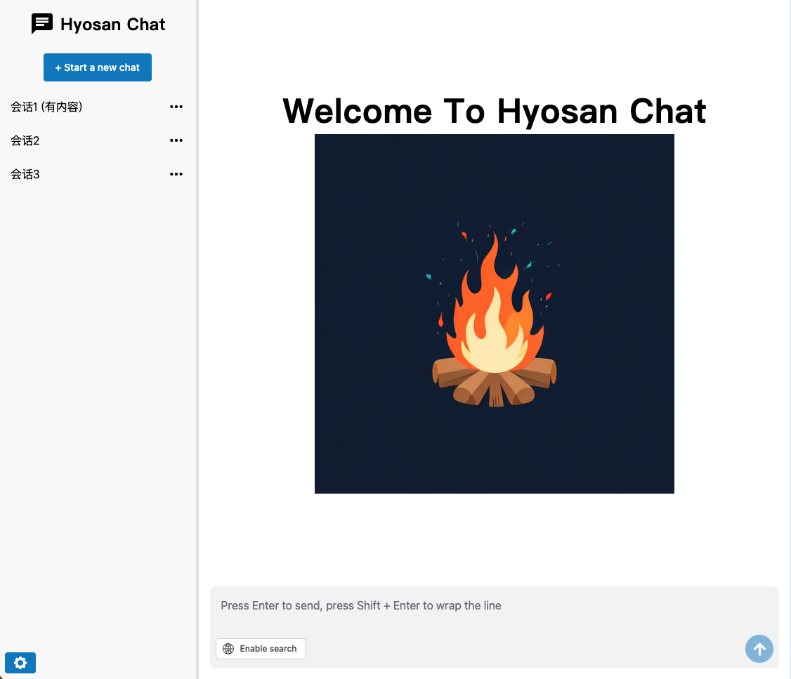
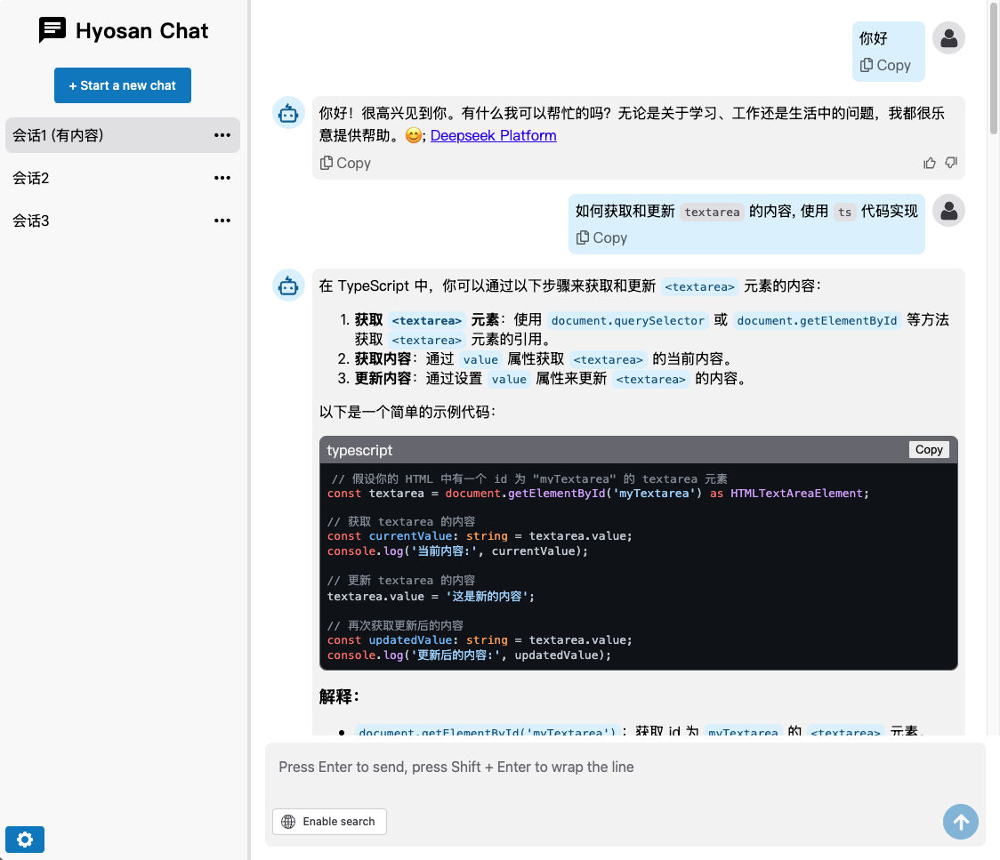
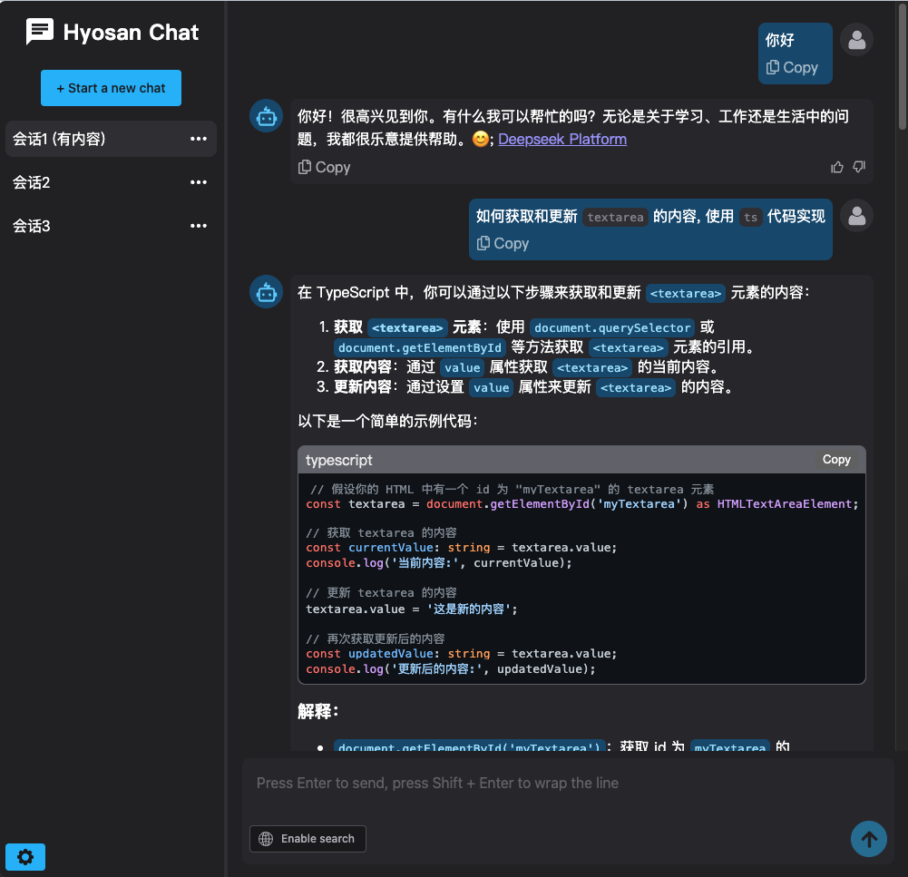
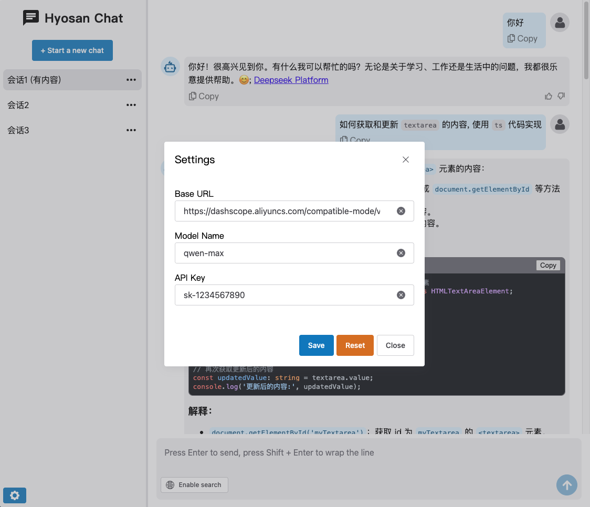
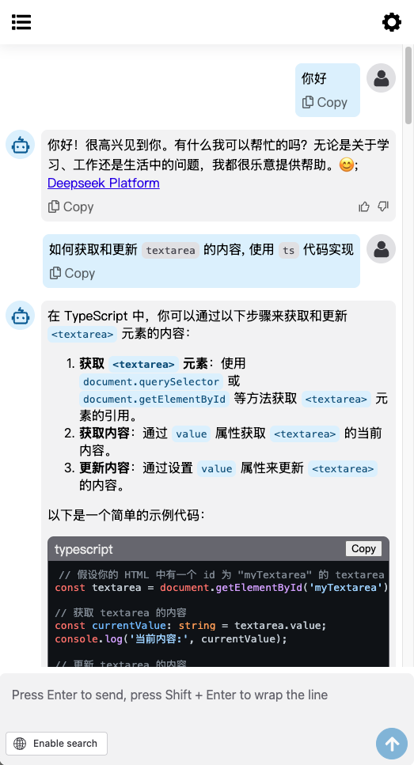

# hyosan-chat







## 介绍
`hyosan-chat` 是一个基于 [Lit](https://lit.dev) 和 [Shoelace](https://shoelace.style/) 实现的 AI 对话组件库; 该项目旨在提供一个现代化、高性能且易于扩展的 Web 组件库, 用于构建智能对话界面; 最终实现效果将类似于 [ant-design-x](https://x.ant.design/index-cn)

## 功能特性
- **`Web Components`**: 使用 [Lit](https://lit.dev) 构建的自定义元素, 确保跨框架兼容性
- **`UI` 组件库**: 基于成熟的基础组件库 [Shoelace](https://shoelace.style/)
- **`AI` 集成**: 支持与多种 `AI` 模型和服务集成, 提供智能对话功能
- **模块化设计**: 组件高度解耦, 便于按需引入和扩展
- **性能优化**: 通过 [vite@^6.1.0](https://github.com/vitejs/vite) 构建工具链, 确保快速开发和高效的生产环境性能

## 技术栈
- [Lit@^3.2.1](https://lit.dev): `Web Component` 库
- [shoelace@^2.20.0](https://shoelace.style/): 使用 `Web Components` 实现的 `UI` 组件库
- [vite@^6.1.0](https://github.com/vitejs/vite): 现代化的前端构建工具
- [TypeScript](https://www.typescriptlang.org/): 强类型语言, 确保代码质量和可维护性
- [biome](https://biomejs.dev/zh-cn/guides/getting-started/)：代码格式化和 `lint` 工具, 保证代码风格一致性和质量

## 安装
```bash
pnpm i hyosan-chat
```

## 使用
[🔗 `demo` 页面](https://snazzy-khapse-06e16b.netlify.app/) 的源码可直接参考 [`src/hyosan-chat-demo.ts`](./src/hyosan-chat-demo.ts)

组件附带了一个用于声明自定义元素信息的文件, 可以实现在 `vscode` / `JetBrains IDE` 中的代码补全功能

### vscode
需要在 `vscode` 的 `settings.json` 中声明组件提供的 `types`:

`.vscode/settings.json`:
```diff
{
+  "html.customData": [
+    "./node_modules/hyosan-chat/dist/cem-types/vscode.html-custom-data.json"
+  ]
}
```

### JetBrains IDE
组件已经声明了一个 `dist/web-types.json` 文件, **在 `JetBrains IDE` 中应该会检测到**, 如果没有任何提示, 你可能需要在 `package.json` 中声明 `web-types`, 可参考 [JetBrains IDEs - Shoelace](https://shoelace.style/getting-started/usage#jetbrains-ides)

### TypeScript
组件完全使用 `TypeScript` 编写, 也基于 [custom-elements-manifest](https://custom-elements-manifest.open-wc.org/) 提供了一流的 `TypeScript` 支持, 只需引入组件提供的类型文件即可

`tsconfig.json`:
```diff
{
  "compilerOptions": {
    // ...
+    "types": [
+      "hyosan-chat/dist/cem-types/vue/index.d.ts"
+    ]
  },
}

```

### vue
> [!TIP]
> 具体使用方式可参考示例项目: [hyosan-chat-vue-demo](https://github.com/SublimeCT/hyosan-chat-vue-demo)  
> 请先阅读官方文档 [在 Vue 中使用自定义元素](https://cn.vuejs.org/guide/extras/web-components#using-custom-elements-in-vue)

在 `Vue` 中默认将所有元素作为 vue 组件, 但自定义元素不能被当做 vue 组件进行处理, 我们需要显示地声明哪些是自定义组件:

`vite.config.ts`:
```typescript
import { defineConfig } from 'vite'
import vue from '@vitejs/plugin-vue'

// https://vite.dev/config/
export default defineConfig({
  plugins: [
    vue({
      template: {
        compilerOptions: {
          isCustomElement: tag => tag.includes('hyosan-')
        }
      }
    })
  ],
})
```

以上配置是将 `hyosan-*` 组件作为自定义组件处理

- 在代码中我们也必须严格使用 `<hyosan-chat>`, 而不能写成 `<HyosanChat>`
- 对于 `slot` 也不能使用 `v-slot` / `#` 语法, 因为 `Web Components` 的插槽是原生的 [slot](https://developer.mozilla.org/zh-CN/docs/Web/HTML/Element/slot), vue 的特殊插槽语法无法在自定义组件中使用

> [!TIP]
> 关于自定义元素使用插槽的局限性可参考 [插槽 - vue](https://cn.vuejs.org/guide/extras/web-components.html#slots)

vue 对于 `Property` 参数(在 [Properties](#properties) 中标注了哪些属性是 `Property`) 必须添加 `.prop` 修饰符:

```html
<hyosan-chat :messages.prop="messages"></hyosan-chat>
```

### react
TODO

## API
### Properties
> [!TIP]
>
> 关于 属性类型:
>
> [Lit@^3.2.1](https://lit.dev) 组件可以接收 `Property` / `Attribute` 参数:
> - `Attribute`: 通过 **`HTML` 元素的属性(`attribute`)** 传递数据, 并且 `attribute` 属性值会转换为 `string` 类型
> - `Property`: 通过 `JS` 获取组件, 并 **在组件对象上** 添加属性, 并且 `Property` 属性值会转换为 `JS` 原生数据类型

| 属性名 | 类型 | 属性类型 | 默认值 | 描述 | [Reflect](https://lit.dev/docs/components/properties/#reflected-attributes) |
| --- | --- | --- | --- | --- | --- |
| `applicationTitle` | `string` | `Attribute` | `'Hyosan Chat'` | 应用标题 |  |
| `panelSnap` | `string` | `Attribute` | `'25% 50%'` | 分割面板的可捕捉位置 | ✅ |
| `panelPosition` | `number` | `Attribute` | `25` | 分隔线与主面板边缘的当前位置(百分比, `0-100`), 默认为容器初始大小的 `50%` | ✅ |
| 💡 `conversations` | `Array<Conversation>` | `Property` | `[]` | 会话列表数据源 | ✅ |
| `currentConversationId` | `BaseService` | `Attribute` | `''` | 当前会话 ID | ✅ |
| 💡 `service` | `BaseService` | `Property` | `new DefaultService()` | 会话服务配置参数 | |
| 💡 `messages` | `BaseServiceMessages` | `Property` | `undefined` | 会话服务消息列表 | ✅ |
| `showAvatar` | `boolean` | `Attribute` | `undefined` | 是否显示头像 | ✅ |
| `showRetryButton` | `boolean` | `Attribute` | `true` | 是否显示 重新生成 按钮 | |
| `showLikeAndDislikeButton` | `boolean` | `Attribute` | `true` | 是否显示 👍 和 👎 按钮 | |
| `onCreateMessage` | `(content?: string) => string \| Promise<string>` | `Property` | `undefined` | 创建消息的回调函数, 当 **没有选中会话** 或 **点击开始新聊天按钮** 时, 如果直接开始发送消息, 会调用此函数, 组件会等待函数返回一个 conversationId, 然后再发送消息; 如果不返回 conversationId, 则不会在组件内部改变 conversationId, 这就相当于创建了一个没有回话 ID 的临时聊天 | |
| `onEnableSearch` | `(open: boolean) => void \| Promise<void>` | `Property` | `undefined` | 如果传入则显示联网搜索按钮, 用户点击搜索按钮时 调用此方法 | |
| `shoelaceTheme` | `HyosanChatShoelaceTheme` | `Attribute` | `HyosanChatShoelaceTheme.shoelaceLight` | [shoelace 主题](https://shoelace.style/getting-started/themes#dark-theme), 可用于切换夜间模式 | |

### Slots
> [!TIP] 关于 插槽
> [Lit@^3.2.1](https://lit.dev) 的插槽与 `vue` 的插槽不同, 基于原生的 [`<slot>` 元素](https://developer.mozilla.org/zh-CN/docs/Web/API/Web_components/Using_templates_and_slots) 实现, 不具备作用域插槽, 也不能在组件内部多次渲染插槽

| 名称 | 描述 |
| --- | --- |
| `conversations` | 左侧会话列表 |
| `conversations-header` | 左侧会话列表的 `header` 部分 |
| `conversations-footer` | 左侧会话列表的 `footer` 部分 |
| `main-welcome` | 右侧消息列表的 `welcome` 界面 |
| `main-header` | 右侧消息列表的 `header` 部分 |

### Events
| 事件名 | 参数 | 描述 |
| --- | --- | --- |
| `conversations-create` | `undefined` | 点击创建新会话按钮 |
| `click-conversation` | `CustomEvent<{ item: Conversation }>` | 点击左侧会话列表中的会话 |
| `change-conversation` | `CustomEvent<{ item: Conversation }>` | 点击 **切换** 左侧会话列表中的会话 |
| `send-message` | `CustomEvent<{ content: string }>` | 点击发送按钮 |
| `hyosan-chat-settings-save` | `CustomEvent<{ settings: ChatSettings }>` | 在设置弹窗中点击保存按钮 |
| `edit-conversation` | `CustomEvent<{ item: Converastion }>` | 在会话列表中点击编辑按钮, 并保存 |
| `delete-conversation` | `CustomEvent<{ item: Converastion }>` | 在会话列表中点击删除按钮 |
| `hyosan-chat-click-like-button` | `CustomEvent<{ message: BaseServiceMessageItem, item: BaseServiceMessageNode }>` | 点击 Like 按钮(点赞) |
| `hyosan-chat-click-dislike-button` | `CustomEvent<{ message: BaseServiceMessageItem, item: BaseServiceMessageNode }>` | 点击 Dislike 按钮(点踩) |

### CSS Parts
可以使用 [::part()](https://developer.mozilla.org/en-US/docs/Web/CSS/::part) 选择器修改组件的样式, 由于 `Web Components` 的样式隔离的特性, 组件外部想要修改组件内的样式只能通过 `::part()` 选择器或组件内部引用的 [css 变量](#css-variables) 来进行控制

| 名称 | 描述 |
| --- | --- |
| `base` | 根组件(`hyosan-chat`) 最外层元素 |

### CSS Variables
组件提供的 css 变量包含两部分:

- 基础组件库 [shoelace](https://shoelace.style/getting-started/themes) 的 css 变量: 参考 [Themes - shoelace](https://shoelace.style/getting-started/themes)
- 组件内部使用的 css 变量: 参考 [src/sheets/global-styles.css](./src/sheets/global-styles.css) 文件

## 主题
组件通过底层的基础组件库 [shoelace](https://shoelace.style) 提供了基础的 `light` / `dark` 两种主题, 如需创建新主题, 可参考 [Creating a theme](https://shoelace.style/getting-started/themes#creating-a-new-theme)

## 贡献指南
参考 [CONTRIBUTING](./CONTRIBUTING.md)
